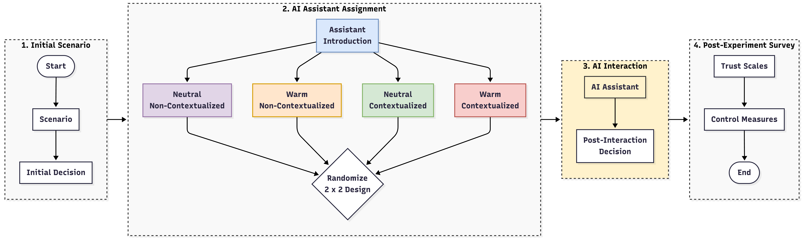
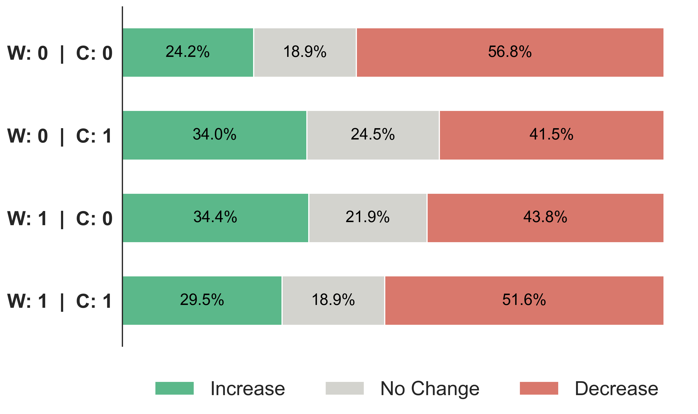
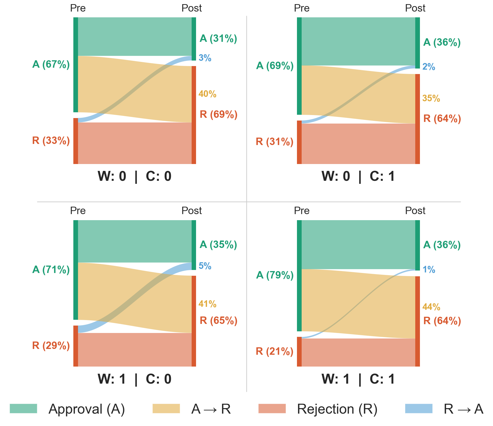

# Personalized to Persuade: The Effects of Contextualization and Warmth on Trust and Reliance in Conversational AI.**

## Paper Summary

The paper studies whether contextualized AI responses and warmer conversational
style make people trust and rely on a conversational AI more. Participants read
a fictional flood-risk scenario about the StormShield barrier system, made an
initial decision about whether to approve the expert-recommended risk budget,
and then interacted with an AI assistant that argued against the experts.

The experiment used a 2 x 2 design:

- **Contextualization (C):** generic response vs. response tailored to the
  participant's background.
- **Warmth (W):** neutral tone vs. warm tone with friendly phrasing and emojis.

The main outcomes were:

- **Persuasion:** change in confidence in the experts after the AI interaction
  (`ConfDiff = confidence_pre - confidence_post`). Higher values indicate a
  stronger shift away from the expert position.
- **Reliance:** post-interaction approval of the anti-expert position,
  controlling for the participant's pre-interaction decision.

The final SEM analyses use **N = 380** participants after attention, timing,
missingness, and outlier filtering.

## The Experiment



## Key Results

### Persuasion Model

|     | $\beta$ | p-value | Interpretation |
| --- | ---: | ---: | --- |
| Warmth | -0.164 | .021 | Warmth alone reduces persuasiveness. |
| Contextualization | -0.198 | .003 | Contextualization alone reduces persuasiveness. |
| Warmth x Contextualization | 0.259 | .002 | The combined condition reversed the single-cue patterns, increasing persuasion. |
| Emotional Trust | -0.296 | < .001 | Higher emotional trust predicted less persuasion by the AI. |
| Competent Trust | 0.326 | < .001 | Higher competent trust predicted more persuasion by the AI. |

Indirect effects through emotional and competent trust were not significant.
The main result is therefore a direct interaction effect:
the AI was more persuasive when both cues were present together, or when both
were absent, than when only one cue was present.



The figure shows whether participants' confidence in the experts increased,
decreased, or stayed the same after the AI interaction. The strongest shifts
away from the experts appear when both cues are absent (W=0, C=0) or both are
present (W=1, C=1): in both cases, more than half of participants reported
lower confidence in the experts. When only one cue was present, the shift was
weaker, with decreases closer to 42-44%.

### Reliance Model

|     | $\beta$| p-value | Interpretation |
| --- | ---: | ---: | --- |
| Competent Trust | 0.220 | .025 | Competent trust predicted greater reliance on the AI. |
| AI Literacy | 0.167 | .020 | Higher AI literacy was associated with greater reliance. |
| Agreeableness | -0.140 | .046 | Higher agreeableness was associated with less reliance. |
| Warmth | -0.029 | .726 | No significant direct effect. |
| Contextualization | -0.028 | .751 | No significant direct effect. |
| Warmth x Contextualization | 0.099 | .359 | No significant interaction effect. |

Across conditions, 35-44% of participants shifted from approving the experts'
budget to rejecting it after interacting with the AI, suggesting that reliance
was persistent but not meaningfully changed by the warmth or contextualization
manipulations.



The alluvial plot tracks whether participants approved (A) or rejected (R) the
expert-recommended budget before and after the AI interaction. Since the AI
argued against the experts, movement from A to R represents reliance on the AI.
Across conditions, 35-44% of participants switched from approval to rejection,
and the post-interaction distributions converged despite different starting
levels of expert approval. 

## Repository Contents

- `app.py`, `chat_helpers.py`, `SYS_PROMPT.txt`: Gradio chatbot used in the
  Qualtrics experiment.
- `Qualtrics_Survey.pdf`: survey instrument.
- `sem_analysis.R`: persuasion analysis using OLS checks and SEM.
- `sem_binary_analysis.R`: binary reliance SEM.
- `sem_power.R`: Monte Carlo power analysis for the SEM.

Generated local outputs, when present, are written to `sem_outputs/`,
`sem_binary_outputs/`, `power_outputs/`, and `Images/`.

## Reproducing Analyses

Please obtain the data from https://data.mendeley.com/datasets/fj29gwghfm/2 as `Results.csv`, then run the R scripts in the repository root:

```r
install.packages(c("readr", "dplyr", "lavaan", "MASS"))
```

Then run:

```sh
Rscript sem_analysis.R
Rscript sem_binary_analysis.R
Rscript sem_power.R
```

The chatbot app requires an `OPENAI_API_KEY` environment variable before running
`app.py`.
